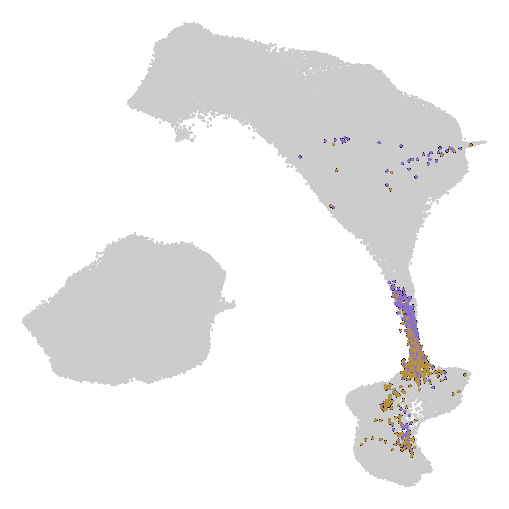
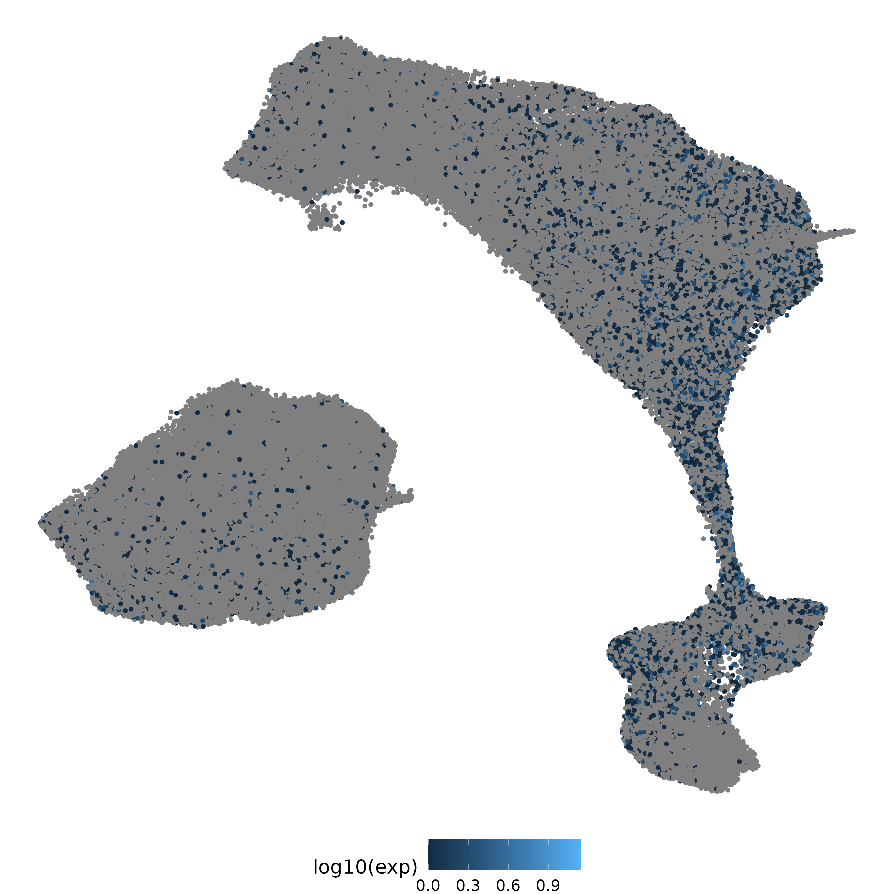

# Single Cell RNA-Seq

Single-cell transcriptomic profiling presents itself as a powerful tool to understand biological development.

## Description

In a 2024 publication, Qiu et al. leveraged the single-cell RNA-seq data of mouse embryo nuclei spanning late gastrulation to birth to infer a rooted tree of cell-type relationships. 
In this repo, we adapted the code from Qiu et al. to delineate the relationship between gut cells and hepatocytes. 
Our work shows that similar cell-type lineage could be inferred for any cell types or tissues of interest.

## Getting Started

### Dependencies

The R scripts require the following R packages:
* Matrix
* dplyr
* ggplot2

The Python script requires the following Python libraries:
* scanpy
* pandas
* numpy
* annoy

### Executing program

Run the scripts in the following order:
* extract_subset_cells.R
* subset_scRNAseq_wf.py
* visualization.R

"extract_subset_cells.R" extracts data of given cell types from the complete mtx files. It probably requires at least 100GB of RAM.
"subset_scRNAseq_wf.py" reprocesses the extracted subset of data, applying dimensionality reduction using scanpy.
"visualization.R" makes 2D UMAP plots for the selected cell types, with the option of highlighting the expression of a specific gene.

To run these scripts successfully, you need to download the two folders named "mtx" and "other" from the JAX data (see link in the Acknowledgement section).
Make sure to change the paths to where you want to save and load the data, including the intermediate files (e.g., lines 7-8 of "extract_subset_cells.R").

## Examples of output

Here is a 2D UMAP plot with the mutual nearest neighbors in gut cells and hepatocytes highlighted.

Here is a 2D UMAP plot with Gata6 expression levels highlighted.
 

## Authors

Junmin Wang

## Acknowledgments

* [Qiu et al., Nature, 2024](https://www.nature.com/articles/s41586-024-07069-w)
* [JAX data](https://shendure-web.gs.washington.edu/content/members/cxqiu/public/backup/jax/download/)
* [JAX code](https://github.com/ChengxiangQiu/JAX_code)
